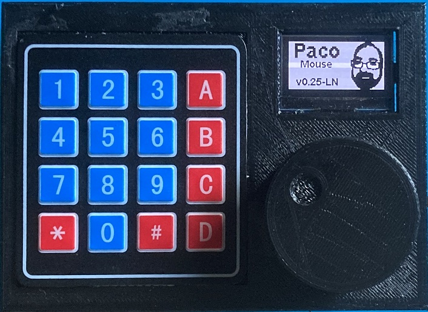

# PacoMouse

Firmware for a throttle on the Arduino Nano or Wemos D1 Mini (ESP8266) platform. 
  * Versions for Loconet, Loconet over TCP/IP, Xpressnet, Xpressnet LAN, ECoS or Z21 protocols
  * Control of Locomotives
  * Control of accesories (turnouts, platform, etc.)
  * CV and LNCV programming
  * Dispatch and phone lock feature
  * Locking of some features for guest or club use.
  * Automation
  * Games
  * Rotary encoder for loco speed and direction
  * Keypad for easy numeric input
  * OLED in different sizes
  * Hardware test program included
  * Avaiable in different languages:

  
  
---

  

  ## Videos

  

  

---

## Copyright
Copyright (c) 2022-2025 Paco Cañada, [The Pows](https://usuaris.tinet.cat/fmco/)   
All rights reserved.

---

## Documentation
- https://usuaris.tinet.cat/fmco/
- https://fmcopaco.github.io/
- Read the [manual](doc/PacoMouse_manual.pdf) in the doc directory

---

## License
Proprietary.  
Sources are only provided to compile and upload to the device.    
Modifiyng source code or forking/publishing this project ist not allowed.  
Commercial use is forbidden.  

---

## Used Libraries
  * ESP8266WiFi (LGPL)
  * WiFiUdp (LGPL)
  * Wire (LGPL)
  * Keypad (GNU)
  * Keypad_I2C (LGPL)
  * SSD1306Ascii (MIT)
  * SSD1306AsciiAvrI2c (MIT)
  * SSD1306AsciiWire (MIT)
  * LocoNet (LGPL)

