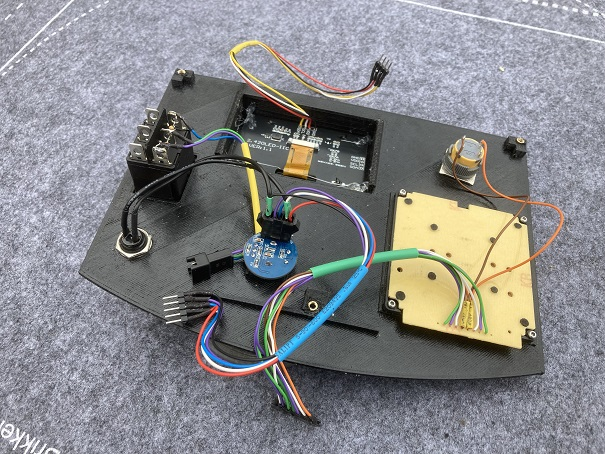

# PacoMouse Console 3D files

## Bill of materials (BOM)

* Keypad 4x4
* Encoder EC11
* OLED (SSD1306, SH1106, SSD1309)
* PCB PacoMouse
* KCD4-604-6P (DPDT switch)
* Emergency switch 16mm
* Pushbutton 12mm
* 3 Screws M3x14mm
* 4 Screws M2x4mm
* 4 screws M2x6mm
* 4 Brass threaded insert M2x2
* 3 Brass threaded insert M3x4

## Wiring

 

